# BiltekTeknikDestekPaneli

- Bu panel Teknik Servis şirketleri için kullanılabilecek. Cihaz ile ilgili gerekli bilgilerin tutulduğu, müşterilerin kendi cihaz durumlarını görebildiği bir teknik servis panelidir.

- Web kurulumu için [web/README.md](web/README.md), flutter kurulumu (android/ios) için [flutter/README.md](flutter/README.md) deki talimatları izleyin.

- Ekran Görüntüleri
    - [Web](#web)
    - [Mobil Uygulama](#mobil-uygulama)

- Bağlantılar
    - [Website](https://teknikservis.biltekbilgisayar.com.tr/)
    - Mobil Uygulama (Yayınlandığında eklenecek)

# Ekran görüntüleri

## Web

### Giriş sayfası

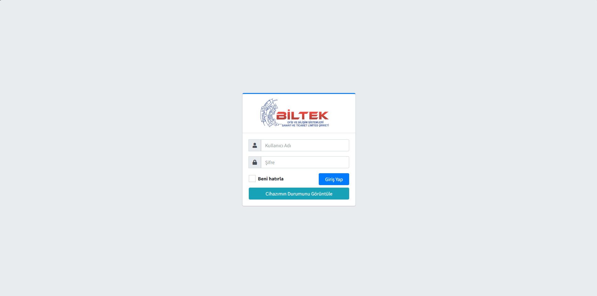

### Cihazlar Sayfası (Personeller İçin)

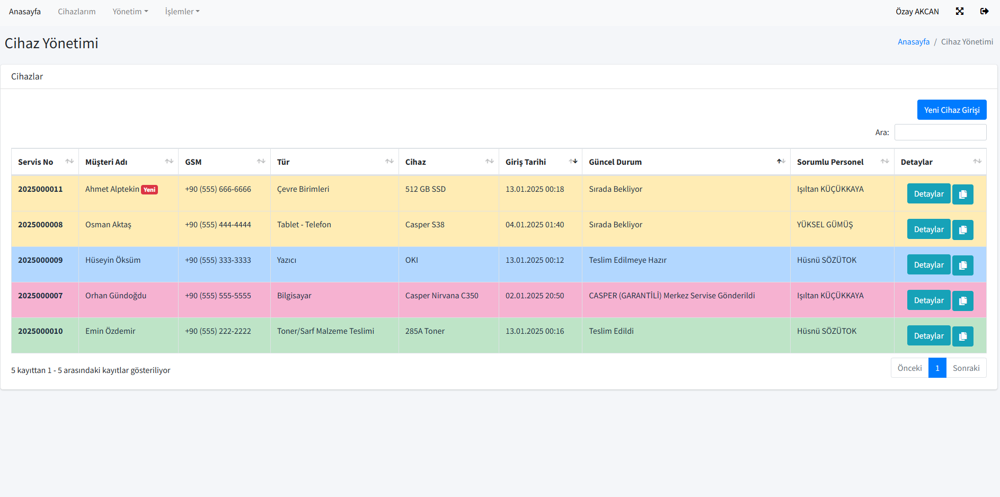

### Yeni Cihaz Girişi

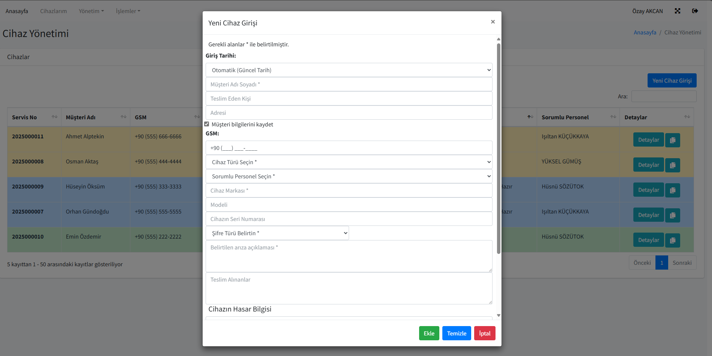

### Cihazlar Detayları

- 1

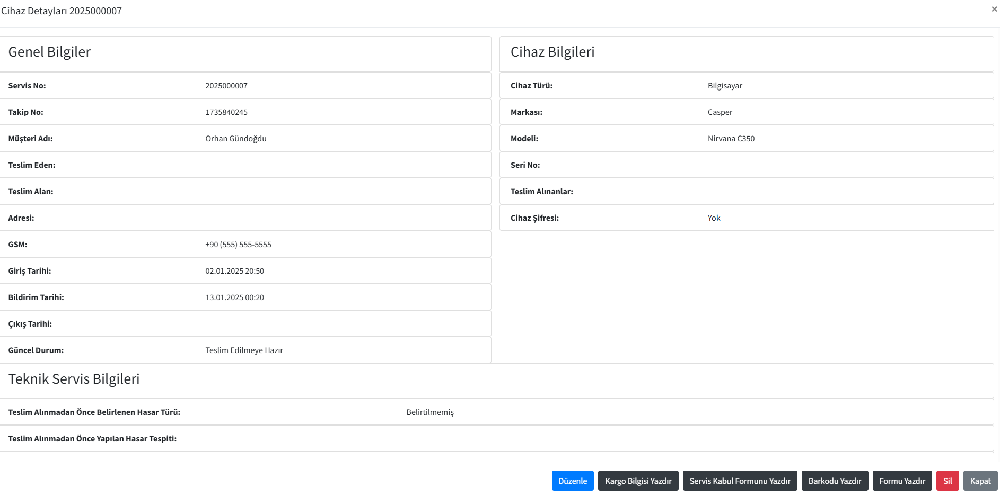

- 2

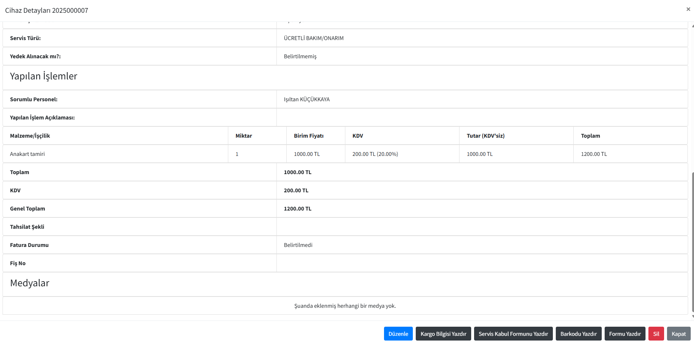

### Barkod Yazdırma (Barkod boyutları barkodunuza göre Yönetim/Ayarlar bölümünden özelleştirilebilir)

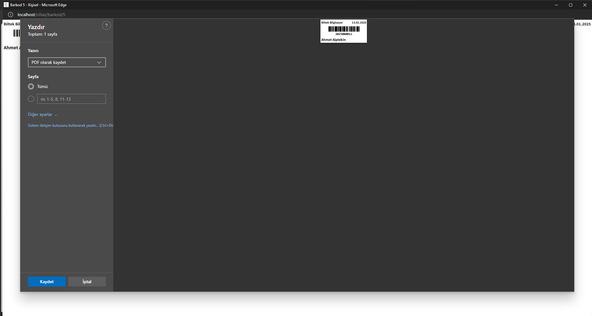

### Cihaz Bilgilerini Düzenleme

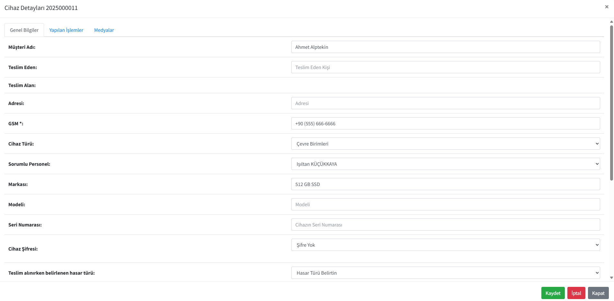

### Teknik Servis Formu (Cihaz müşteriye teslim edilirken çıkartılacak.)

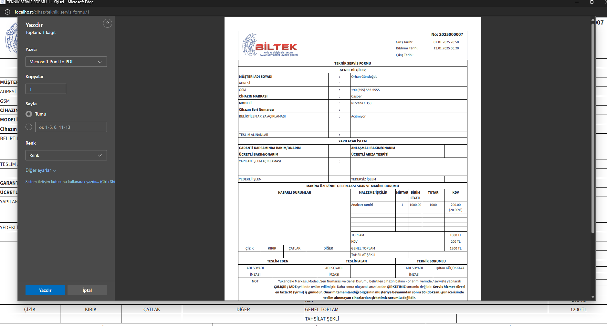

### Cihaz Durumunu Görüntüleme (Müşteriler İçin)

- 1

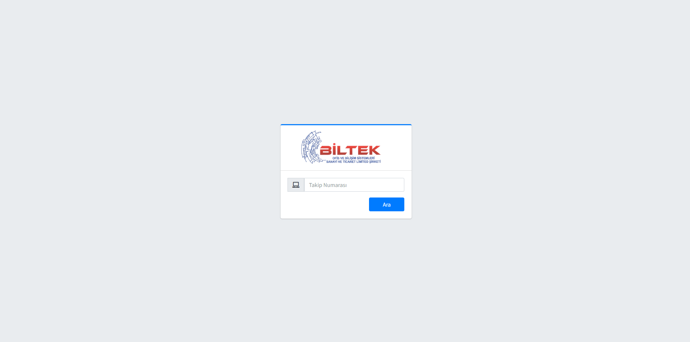

- 2

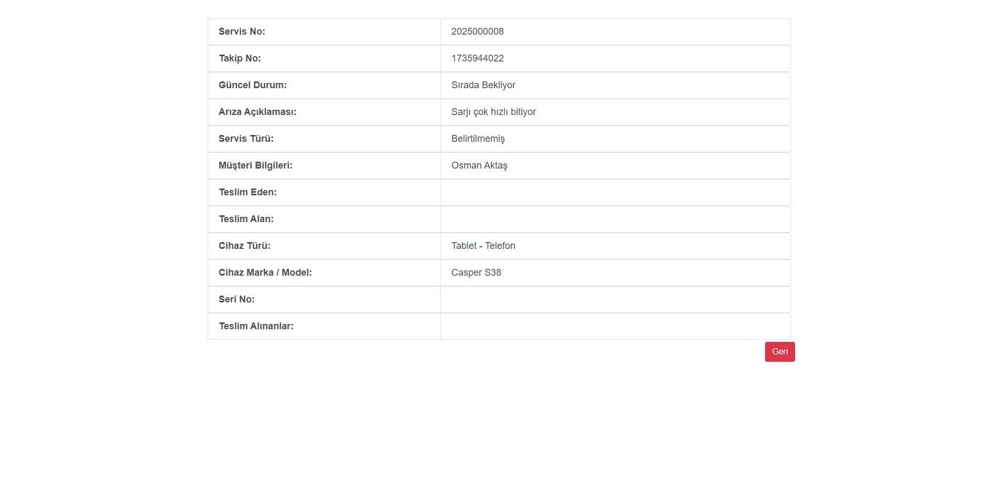

### Kış Teması (Yönetim/Ayarlar bölümünden açılıp kapatılabilir)

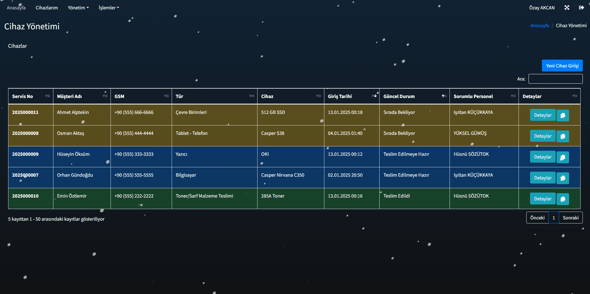

[En Yukarı Git](#biltekteknikdestekpaneli)

## Mobil Uygulama

- Ekran görüntüleri uygulama tam kullanıma hazır olduğunda eklenecek.

[En Yukarı Git](#biltekteknikdestekpaneli)